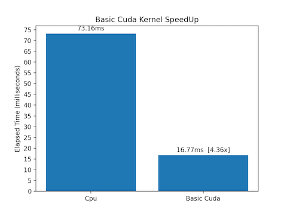
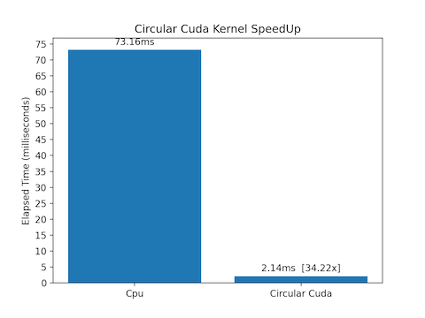

# README #

This a CUDA C parallel implementation of the **Merge** operation.   
Algorithm's parallelization is based on the **co-rank** function provided by Siebert et al. in their work [Efficient MPI Implementation of a Parallel, Stable Merge Algorithm](https://doi.org/10.1007/978-3-642-33518-1_25).  

## Project Structure ##

### pyutils/ ###
Here-in Python scripts for plotting speedups has been provided.   

### src/ ###
Here-in CUDA C and C source code can be found.   

## Implementations Provided ##

* **Serial Merge** (src/cpu/CpuMerge.c)
* **Basic Parallel Merge** (src/cuda/basic/BasicMerge.cu)
* **Tiled Parallel Merge** (src/cuda/tiled/TiledMerge.cu)
* **Circular Parallel Merge** (src/cuda/circular/CircularMerge.cu)

## Performance Considerations ##

Tests were done on an **Intel (R) Xeon(R) CPU E5440** and a **Nvidia GeForce GTX 980 GPU**.   
Integer arrays with $2^{24}$ elements has been used.   

* **Serial Merge** requires **73.16 ms** for completing.
* **Basic Parallel Merge** requires **16.77 ms** for completing, **4x faster than Serial Merge**.   
   

* **Tiled Parallel Merge** requires **1.11 ms** for completing, **66x faster than Serial Merge**.   
   

* **Circular Parallel Merge** requires **2.14 ms** for completing, **34x faster than Serial Merge**.   
   
 